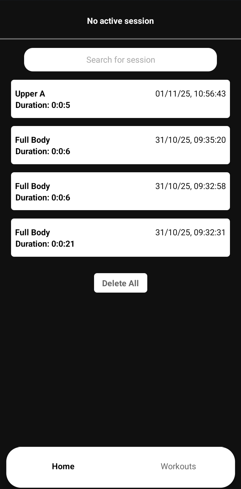
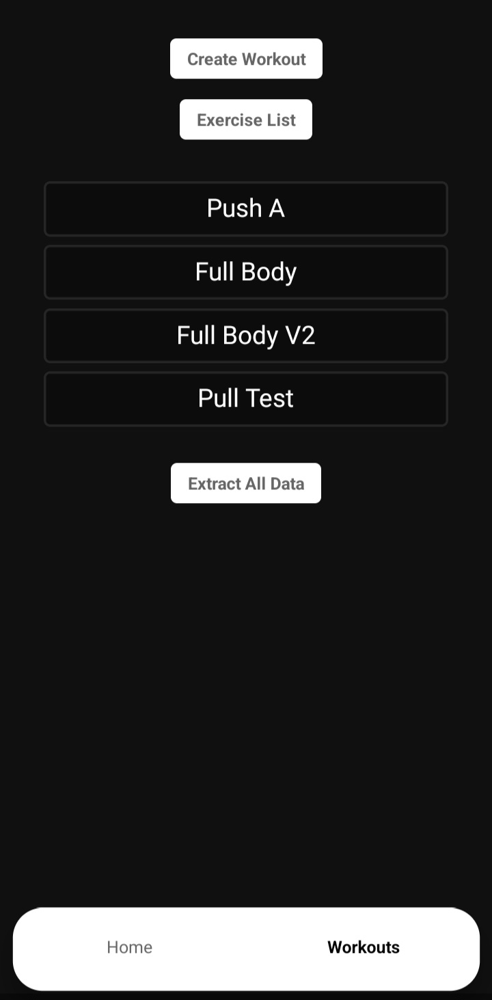
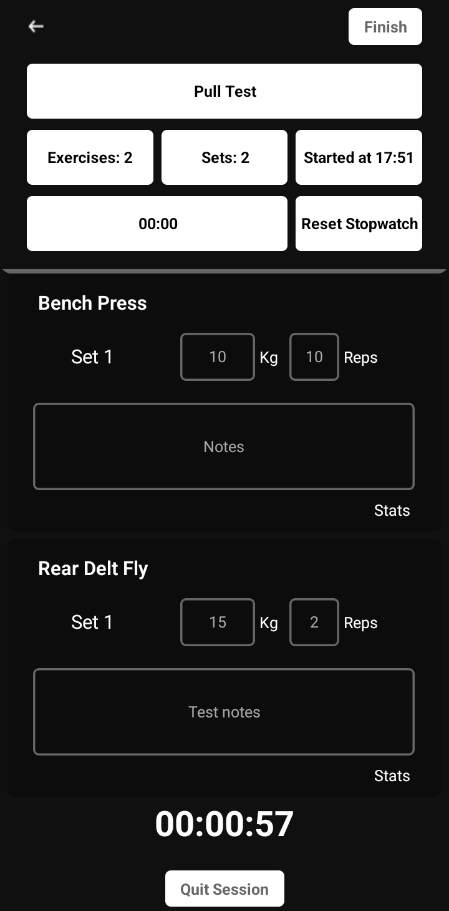
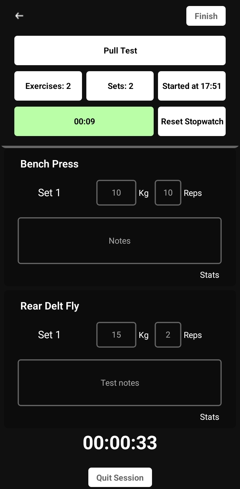
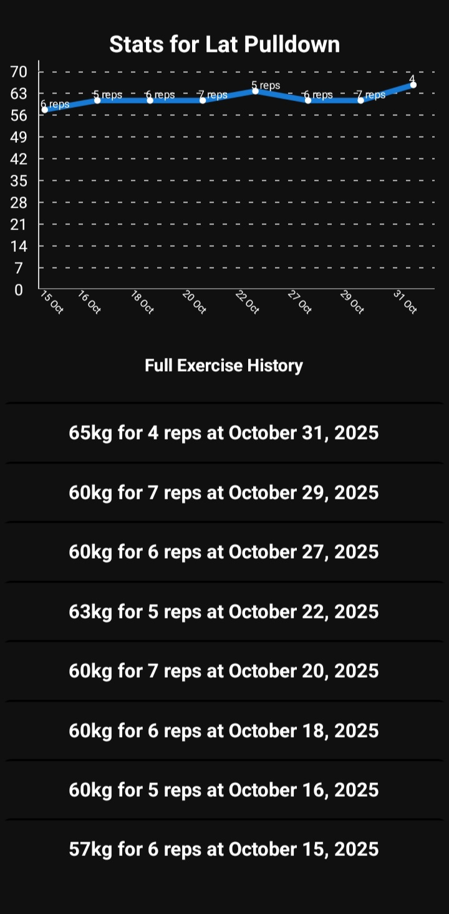
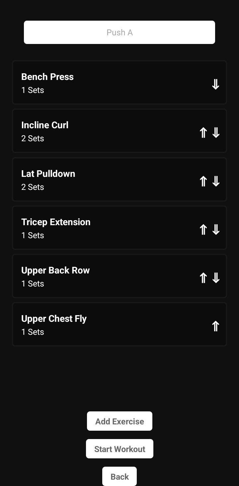

# Overview 

Ext is a workout tracking app built with React Native + Expo. It uses Zustand for state management and Sqlite for persistent data storage.
The app allows the user to create their own exercises and workouts,track workouts as sessions by logging weights and reps used for each set of each exercise of a workout, check data of a given exercise, and more.

  
  
  
  

  
  
  
  

## Using the app
* To use the application out of the box with ads inlcuded(not currently), head over at the playstore link where you can find a downloadable version. You can also find the apk build listed in the assets section of each release.
* If you want to build the app yourself, donwload the source code listed in the assets or directly from the repo. You must have node and npm installed. After you've downloaded the files, run npm install(or equivalent line) to install the requirements. Lastly, if you decide to use expo run:
"eas build -p android --profile apkrelease" for the apk build or
"eas build -platform android" for the aab build.
I have no idea how to make it work with IOS.

## Contributions:
All contributions are welcome and super appreciated! You can check out some of the known issues below, report any bugs you encounter, or suggest new features. Before contributing code, to make the process smoother, please keep a few things in mind. First, if this is your first time setting up the environment for conrtibuting, follow this [guide](https://m-rowe42.medium.com/making-your-first-github-contribution-7041966f105b) ( feel free to reach out for help). Second, there isn't a set style, but as of now most of the code base follows the camelCase convention, indentations depend on what's being implemented but just try to make it somewhat readable, add comments, long ones if needed, explaining a code block if it's not that intuitive, and so on. Third, stick to relatively small commits and add username/preferred name to commit message. Lastly, if you'd like to add a new feature or change something bigger, please email me first or create an issue broadly explaining your idea. Thank you!

## Exercises
The app comes with a few built in exercises and workouts. To view all exercises navigate to the exercise list by pressing the Exercise List button found in the workouts tab, there you can also find the Create Exercise button which allows you to create a custom exercise using a unique name and optional muscle group. You can search/filter exercises in the add exercise list using name or muscle group. Exercise sets can be marked to indicate a reset for exercise progress.

## Workouts
To view workouts or create a custom one, simply open the workouts tab where you can find a button and list. Clicking on a workout shows the workouts exercises, number of sets of a given exercise and button to start workout, while holding an entry starts a session(or prompts with a warning if there is an active session). Changing sets of a given exercise can be done by just clicking the exercise listing, while a long press removes the exercise completely.

## Sessions
Sessions are "active" instances of workout routines. To start a session click on a workout to see the routine where you'll also find a start workout button, or simply hold the workout listing in the workouts tab. A session ends after clicking the finish button in an active session,after which it will save the session and write the set data. If stopped forcefully(by starting a new session while another is active), no data is saved. Finished sessions can be searched/filtered using name or date(using same format as the finished sessions view).

## Known issues and future features:
* Loading of objects from Zustand needs work, both the functions and their implementation;
* Most of UI needs to be improved and standardised;
* When dropdown menu in exercise creation is active, there appears a black box at the bottom;
* Loading screen before actual loading the sessions/workouts(partially);
* Convert non color stuff to CSS, keep color/font stuff in tailwind;

Planned features:
* Edit finished session start and end time;
* Remove set/exercise in active workout;
* Data should be transferable, either account or extracting and importing manually(partially implemented);
* Session based memory option;
* Copy workout;
* More information about exercises;
* Customization and more user stats;
* Add workout search based on focus of workout(eg.if a workout has majority leg exercises, leg focus);
* Huge lack of translations, so options in other languages
